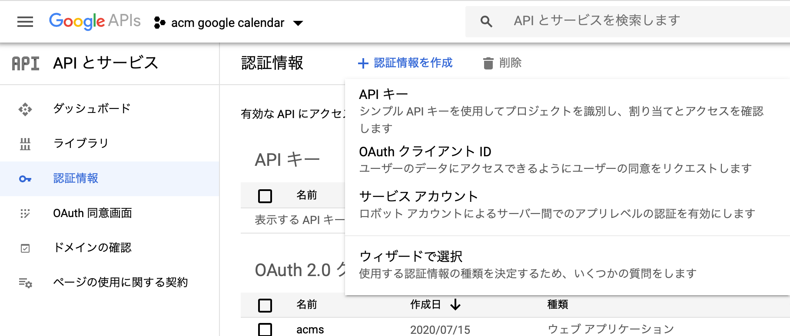
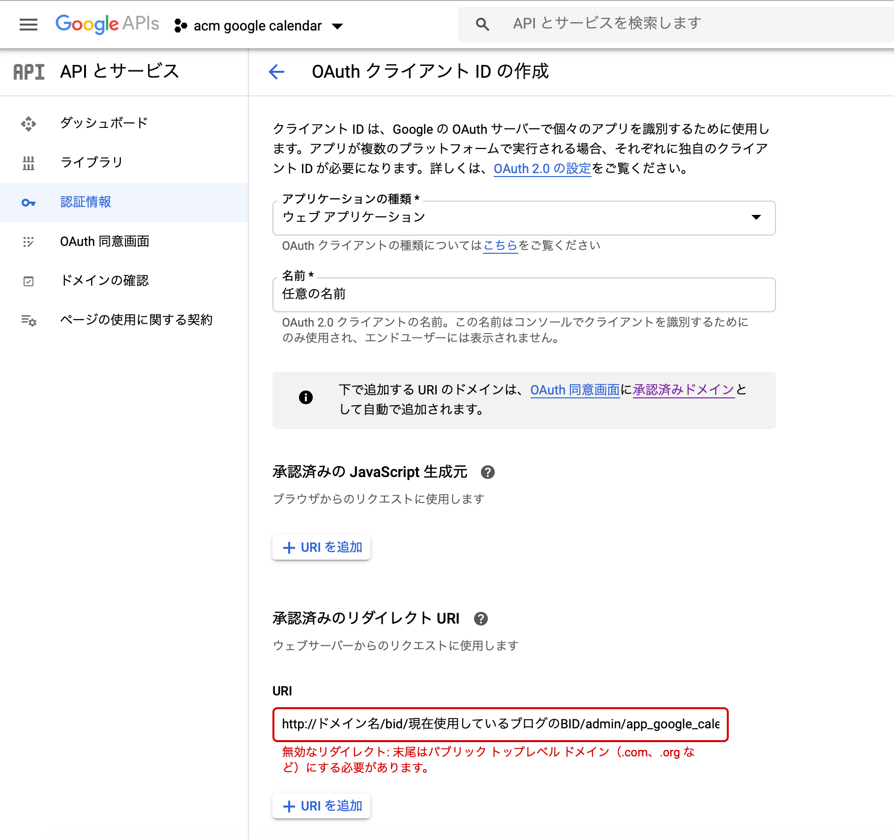
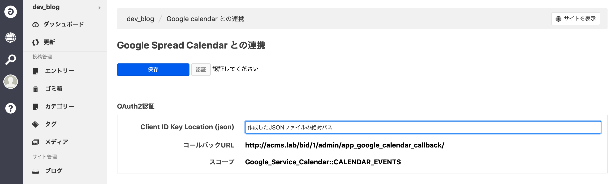
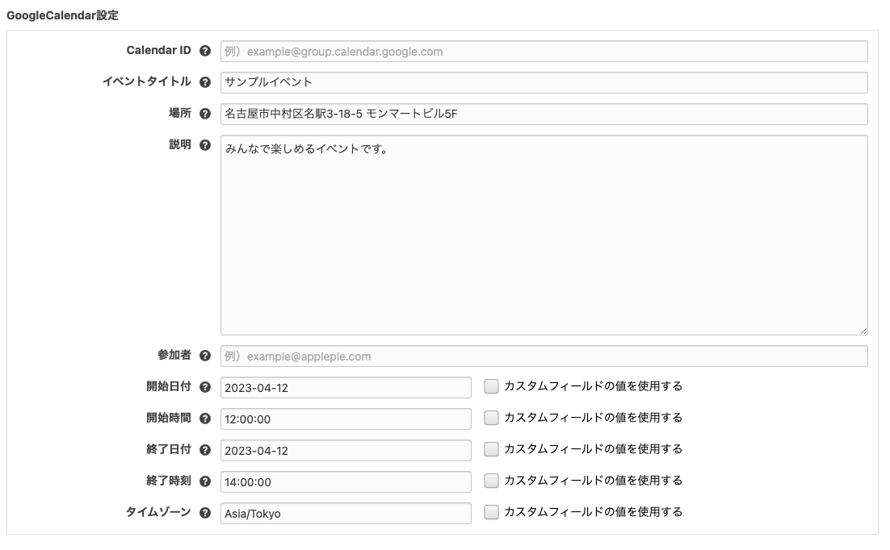
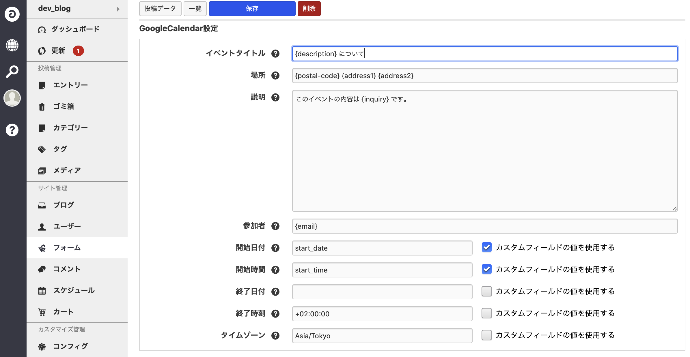

# acms-google-calendar
「[Google Calendar](https://www.google.com/calendar/about/)」と連携し，お問い合わせフォームなどで送信された内容を任意の Google Calendar に登録する拡張アプリです．

## ダウンロード
[Google Calendar for a-blog cms](https://github.com/appleple/acms-google-calendar/raw/master/build/GoogleCalendar.zip)

## 動作環境
- a-blog cms: >=Ver.2.8.0
- php: >=5.4

## 準備
次のステップで a-blog cms と [Google Calendar](https://www.google.com/calnedar/about/) を連携します．

1. ClientID JSON の取得
2. ClientID JSON を CMS側に登録

### 1. ClientID JSON の取得
[Google API Console](https://console.developers.google.com/)にアクセスし，認証情報を作成します．
下の画像の画面で OAuthクライアントID を選択し，OAuthクライアントIDを作成します．


OAuth クライアントID 作成時に設定しなければならない項目は，アプリケーションの種類，名前，承認済みのリダイレクトURLです．
ここでは，下の画像のようにアプリケーションの種類を「ウェブアプリケーション」，承認済みのリダイレクトURLは「ドメイン名/bid/（現在使用しているブログのBID）/admin/app_google_calendar_callback/」と設定します．名前は任意のもので構いません．


作成が完了したら，画像の赤丸で囲まれた場所をクリックします．ここで，JSONファイルがダウンロードされますので，このファイルを ablog cms が動いているサーバにアップロードします(ブラウザからアクセスできないドキュメントルートより上の階層にアップロードすることが望ましいです)．

### 2. ClientID JSON を CMS側に登録
a-blog cms において拡張アプリがHOOK処理を行えるように，config．server．php の設定を変更します．
```php
define('HOOK_ENABLE', 1);
```

extension/plugins に[Google Calendar for a-blog cms](https://github.com/appleple/acms-google-calendar/raw/master/build/GoogleCalendar.zip)をアップロードし，管理画面 > 拡張アプリより， Google Calendar をインストールします．インストール完了後，管理画面 > Google Calnedar より Google Calendar の管理画面に移動します(下の図)．ここで，Client ID Key Location に先ほどアップロードしたJSONファイルが存在する場所を表す絶対パスを入力し，「認証」をクリックします．


## 設定
### 基本的な設定
次に，Google Calendar と連携するフォームの設定を行います．管理画面 > フォーム より，連携したいフォームの設定画面に移動します．「Google Calendar 設定」，「Google Calendar Form 設定」という項目があるので，ここにフォームが送信された時にカレンダーに登録したい値を設定します．例えば入力する値は次のように設定します．

この設定では，フォームが送信された際に，設定した Calendar ID (example_calendar_id) のカレンダーに，イベント名「サンプルイベント」，場所「愛知県名古屋市」，説明「みんなが楽しめるイベントです。」，開始日時「2020/7/1 12:00」，終了日時「2020/7/1 14:00」，タイムゾーン「Asia/Tokyo」であるイベントが追加されます．

### 発展的な設定
カレンダーに登録される値をフォームの内容に応じた値にすることができます．例えば，次のように設定します．

この例では，イベント名「{description} について」，開始日付「{postal-code}{address1}{address2}」，説明「このイベントの内容は {inquiry} です。」のイベントが追加されます．ここで，{}で囲まれた部分には{}内の名前に対応するカスタムフィールド名のフォーム送信時の値が挿入されます．また，時間設定にもカスタムフィールドの値を用いることができます．その際は，右の「カスタムフィールドの値を使用する」チェックボックスにチェックしてください．

### 日付・時間の設定
「開始日付」及び「タイムゾーン」は必須の入力項目となります．それ以外の項目については任意ですが，記述方法によって追加されるイベントの終了時刻が異なります．
- 「開始日付」及び「開始時間」が入力されており，「終了日付」，「終了時間」が入力されていない場合
    - カレンダーに登録される終了日時は，「開始日付」，「開始時間」と同じになります
- 「開始日付」が入力されており，「開始時間」，「終了日付」，「終了時間」が入力されていない場合
    - カレンダーに登録されるイベントは「開始日付」の終日イベントになります
- 「開始日付」及び「終了日付」が入力されており，「開始時間」，「終了時間」が入力されていない場合
    - カレンダーに登録されるイベントは「開始日付」から「終了日付」までの終日イベントになります
    - この際，終了日付も含むイベントを登録したい場合は，終日日付+1日とすることに注意してください
- 「終了日付」及び「終了時間」は，「+yy-mm-dd」及び「+h:i:s」と記述し，それぞれ「開始日付」，「開始時刻」に対しての経過時間を設定できます

### 参加者の設定
参加者欄にはメールアドレスを指定します．イベントが追加された時，ここに記入されたメールアドレスがイベント参加者としてカレンダーに登録されます．この際，Google Calendar の機能で参加者にメールによる通知が行われます．また，参加者として追加されたメールアドレスが Gmail の場合，そのアカウントのカレンダーにイベントが自動的に追加されます．
- 参加者は複数追加することができます．その際は「,」でメールアドレスを区切ってください
    - (例：{email1}, {email2})