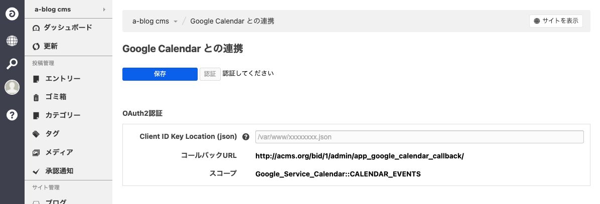

# acms-google-calendar
「Google Calendar」は a-blog cms Ver.2.8.0 より利用可能な a-blog cms の拡張アプリです。 このアプリは「[Google Calendar](https://www.google.com/calendar/about/)」と連携し、お問い合わせフォームなどで送信された内容を任意のGoogle Calendarに登録します。

## ダウンロード
[Google Calendar for a-blog cms](https://github.com/appleple/acms-google-calendar/raw/master/build/GoogleCalendar.zip)

## 準備
次のステップで a-blog cms と [Google Calendar](https://www.google.com/calnedar/about/) を連携します。

1. ClientID JSON の取得
2. ClientID JSON を CMS側に登録

### 1. ClientID JSON の取得
[Google API Console](https://console.developers.google.com/)にアクセスし、認証情報を作成します。
下の画像の画面で OAuthクライアントID を選択し、OAuthクライアントIDを作成します。


OAuth クライアントID 作成時に設定しなければならない項目は、アプリケーションの種類、名前、承認済みのリダイレクトURLです。
ここでは、下の画像のようにアプリケーションの種類を「ウェブアプリケーション」、承認済みのリダイレクトURLは「ドメイン名/bid/（現在使用しているブログのBID）/admin/app_google_calendar_callback/」と設定します。名前は任意のもので構いません。


作成が完了したら、画像の赤丸で囲まれた場所をクリックします。ここで、JSONファイルがダウンロードされますので、このファイルを ablog cms が動いているサーバにアップロードします(ブラウザからアクセスできないドキュメントルートより上の階層にアップロードすることが望ましいです)。

### 2. ClientID JSON を CMS側に登録
a-blog cms において拡張アプリがHOOK処理を行えるように、config.server.php の設定を変更します。
```php
define('HOOK_ENABLE', 1);
```

extension/plugins に[Google Calendar for a-blog cms](https://github.com/appleple/acms-google-calendar/raw/master/build/GoogleCalendar.zip)をアップロードし、管理画面 > 拡張アプリより、 Google Calendar をインストールします。インストール完了後、管理画面 > Google Calnedar より Google Calendar の管理画面に移動します(下の図)。ここで、Client ID Key Location に先ほどアップロードしたJSONファイルが存在する場所を表す絶対パスを入力し、「認証」をクリックします。


## 設定
次に、Google Calendar と連携するフォームの設定を行います。管理画面 > フォーム より、連携したいフォームの設定画面に移動します。「Google Calendar 設定」、「Google Calendar Form 設定」という項目があるので、ここにフォームが送信された時にカレンダーに登録したい値を設定します。例えば入力する値は次の画像のようになります。この設定では、フォームが送信された際に、設定した Calendar ID のカレンダーに、イベント名「サンプルイベント」、場所「愛知県名古屋市」、説明「みんなで楽しめるイベントを開催します」、開始日時「2020/7/1 12:00」、終了日時「2020/7/1 15:00」、タイムゾーン「Asia/Tokyo」のイベントが挿入されます。


先ほどの例では、カレンダーに登録される値は常に決められた値であって、フォームの内容に応じたものではありませんでした。カレンダーに挿入されるイベントを送信されたフォームの内容と関連づけるには、次のように設定します。先ほどの例と異なり、開始日付、開始時間及び終了日付、終了時間の設定がそれぞれ連携するフォームに存在するカスタムフィールド名です。この場合、カレンダーには指定されたカスタムフィールド名のフィールドのフォーム送信時の値が挿入されます。このように、カスタムフィールド名を指定することで、フォームの内容を反映したイベントをカレンダーに挿入できます。


### 注意
Google Calendar にイベントを登録するには、開始日付、開始時間、終了日付、終了時間、タイムゾーンの設定が必須です。これらの値が設定されていない場合や、値が間違っている場合(yy-mm-ddの形式になっていないなど)はイベントが登録されないことにご注意ください。
